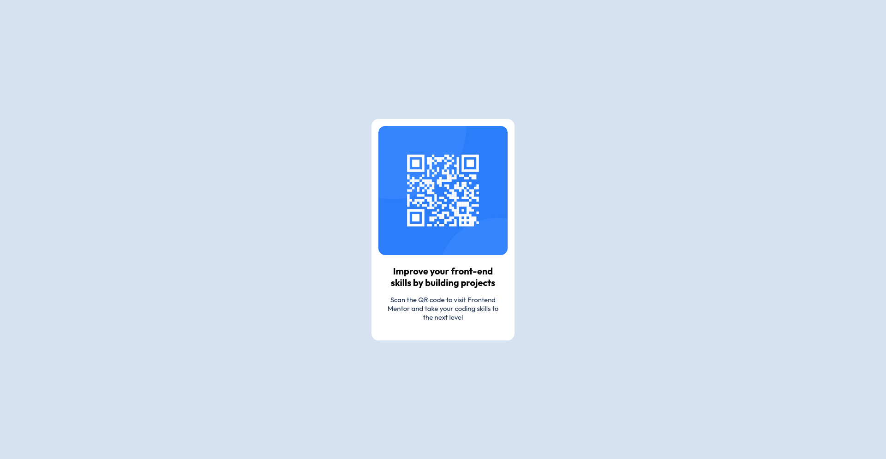

# Frontend Mentor - QR code component solution

This is a solution to the [QR code component challenge on Frontend Mentor](https://www.frontendmentor.io/challenges/qr-code-component-iux_sIO_H). Frontend Mentor challenges help you improve your coding skills by building realistic projects. 

## Table of contents

- [Overview](#overview)
  - [Screenshot](#screenshot)
  - [Links](#links)
- [My process](#my-process)
  - [Built with](#built-with)
  - [What I learned](#what-i-learned)
  - [Continued development](#continued-development)
- [Author](#author)


## Overview

### Screenshot




### Links

- Solution URL: [my github repo](https://github.com/leventsoner/git-test)
- Live Site URL: [the live site](https://leventsoner.github.io/git-test/)

## My process

### Built with

- Semantic HTML5 markup
- CSS custom properties
- Flexbox

### What I learned

I learned how to use flexbox to center the QR code card. I create a flex container with a child element that has the QR code card. I then set the flex-direction to column, and the justify-content to center. This centers the QR code card both horizontally and vertically.
The css code part is as follows:

```css
#qr-container {
    display: flex;
    justify-content: center;
    align-items: center;
    height: 100vh;    
}
```

### Continued development

I want to continue focusing on using flexbox to center the QR code card. I want to learn more about flexbox and how to use it to create more complex layouts. Also sometimes I am abit confused about margin and padding when adjusting the layout. I want to learn more about them.


## Author

- Frontend Mentor - [@leventsoner](https://www.frontendmentor.io/profile/leventsoner)


